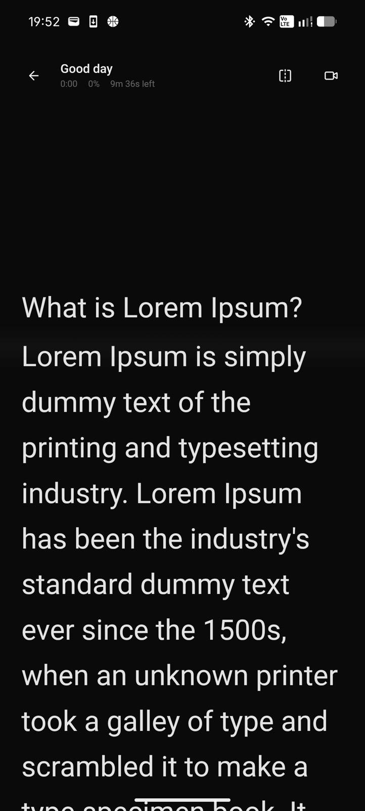
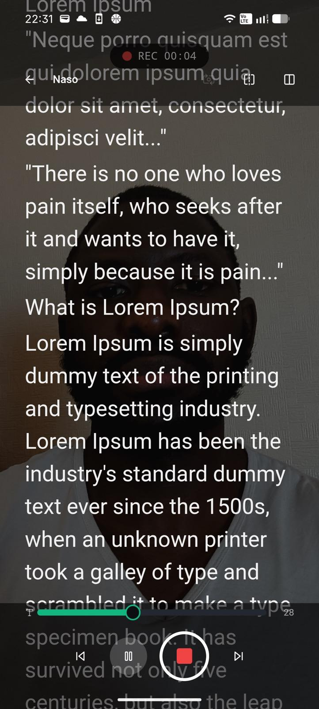
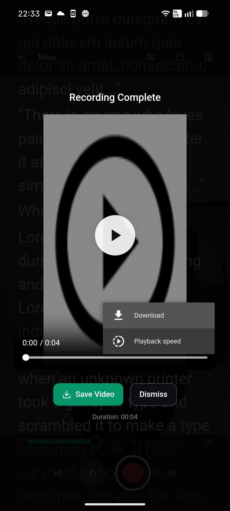
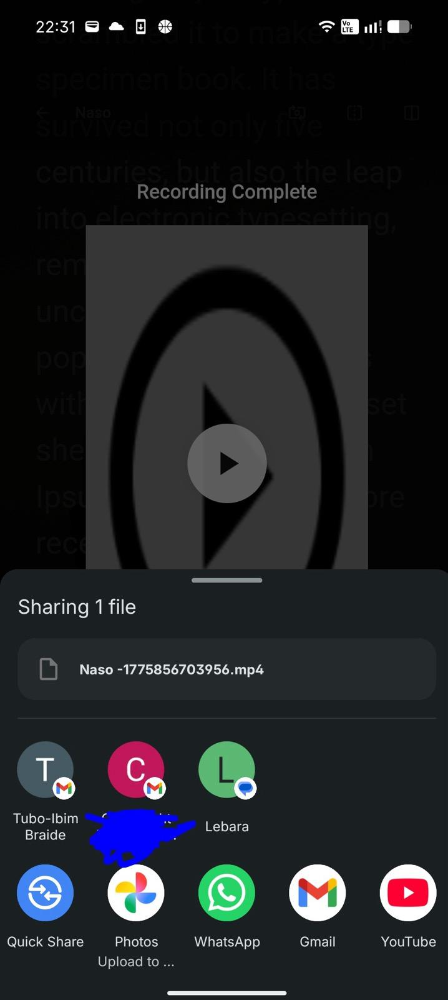

<div align="center">

# Cuevora

**Professional-grade teleprompter for iOS, Android, and the web.**

*Teleprompter features, actually free.*

[](https://react.dev)
[](https://typescriptlang.org)
[](https://capacitorjs.com)
[](https://vitejs.dev)
[](LICENSE)

<br />

[Features](#features) · [What's New](#whats-new) · [Android Release Readiness](#android-release-readiness) · [Architecture](#architecture) · [Getting Started](#getting-started) · [Deployment](#deployment)

</div>

---

## Overview

Cuevora is a cross-platform teleprompter application engineered to deliver a native-quality experience on every device from a single TypeScript codebase. It targets content creators, public speakers, journalists, and media professionals who need reliable, low-latency script scrolling with integrated camera recording — without subscription paywalls.

Cuevora is designed to be usable immediately in guest mode. Scripts, revisions and settings are stored locally by default, and optional Firebase Authentication is prepared for account identity without making the core app depend on a backend.

### Design Goals

| Principle | Implementation |
|-----------|---------------|
| **Single codebase, three platforms** | React + Capacitor compiles to iOS, Android, and PWA from one source tree |
| **60 fps scroll performance** | `requestAnimationFrame`-driven animation loop with delta-time interpolation |
| **Offline-first** | All data persisted in `localStorage`; service worker caches static assets for full offline use |
| **Accessibility-first input** | Voice commands (Web Speech API), touch gestures, and keyboard shortcuts — all first-class |
| **Zero vendor lock-in** | Firebase Auth is optional; the app is fully functional in guest mode with no backend dependency |

---

## What's New

This branch includes a Play Store readiness and UX hardening pass focused on making Cuevora feel more like a premium Android app:

- Android project added with package name `app.cuevora.teleprompter`, Capacitor 8, API 36 target/compile SDK, release bundle support and hardened manifest settings.
- Home now supports pull-to-refresh, visible refresh, sorting, compact/detailed card views, better empty states, per-script options, delete confirmation and undo.
- Editor now shows autosave states: Saving, Saved, Offline and Error saving.
- Player now includes native haptic feedback, a first-run gesture guide, jump-to-start/end actions, reload, clearer Home/back navigation and safer missing-script states.
- Gesture handling now delays single taps briefly so double tap play/pause does not accidentally trigger left/right/centre tap actions.
- Record Mode now includes a camera/microphone permission rationale, retry and back states, better missing-script handling and resource cleanup.
- Login now keeps guest mode first-class, hides Apple sign-in on Android, uses native-friendly redirect sign-in on Android and exposes a prepared passwordless email sign-in path with a clear Firebase TODO.
- Settings now has dedicated sections for Account, Appearance, Teleprompter defaults, Recording and controls, Storage and backup, Privacy and legal, Feedback, Reset app data and About Cuevora.
- Storage now has safer parsing, backup validation, restore support, reset support and tests for corrupted data paths.
- Rehearsal now supports local reports with transcript-derived metrics where speech recognition is available.
- Adaptive scroll can follow recent voice cadence with fixed-speed fallback and manual override.
- Accessibility profiles adjust prompting presentation for low vision, dyslexia-friendly reading, calm focus, captions and simpler controls.
- Accessibility readiness is tracked in `docs/qa/accessibility-test-matrix.md`, covering TalkBack, Switch Access, Voice Access, keyboard, reduced motion and large-text checks.
- Release documentation has been added for Play Store readiness, privacy/data inventory and store listing copy.

## Screenshots

<div align="center">
<table>
<tr>
<td align="center"><br /><b>Splash Screen</b></td>
<td align="center"><br /><b>Teleprompter</b></td>
<td align="center"><br /><b>Scrolling</b></td>
</tr>
<tr>
<td align="center"><br /><b>Camera Access</b></td>
<td align="center"><br /><b>Record Mode</b></td>
<td align="center"><br /><b>Recording Preview</b></td>
</tr>
<tr>
<td align="center" colspan="3"><br /><b>Share / Export</b></td>
</tr>
</table>
</div>

---

## Features

### Teleprompter Engine

- **Frame-perfect scrolling** — `requestAnimationFrame` loop with delta-time calculation guarantees smooth 60 fps playback regardless of device refresh rate
- **Speed control** — Continuous range (1–10×) with named presets (Slow / Medium / Fast / Turbo)
- **Mirror mode** — CSS `scaleX(-1)` transform for beam-splitter and reflective glass setups
- **Focus line** — Semi-transparent gradient highlight anchored at 40% viewport height to guide the reader's eye
- **Countdown timer** — Configurable pre-roll (3 / 5 / 10 seconds) with spring-animated digits
- **4 player themes** — Dark, Light, Studio, High Contrast — selectable during playback
- **Typography controls** — Font size (16–72 px), line spacing (1.0–3.0×), real-time adjustment via slider or pinch gesture
- **Progress telemetry** — Scroll progress bar, elapsed timer, percentage, and estimated time remaining — all computed from word count and WPM setting
- **Adaptive scroll option** — Voice-follow scrolling can use recent speech cadence where supported, with fixed-speed fallback and manual override
- **Safe recovery states** — Missing, deleted or corrupted scripts show useful recovery actions instead of blank screens

### Multi-Modal Input

| Mode | Controls |
|------|----------|
| **Voice** | Web Speech API — "play", "pause", "faster", "slower", "reset" with live transcript indicator |
| **Gesture** | Tap zones (left = rewind, right = forward, centre = toggle UI), swipe up/down = speed, pinch = font size, double-tap = play/pause |
| **Keyboard** | Space (play/pause), ↑↓ (speed), ←→ (seek), M (mirror), F (focus), R (reset), Esc (back) |
| **Haptics** | Native haptic feedback for refresh, play/pause, reset, speed/font changes and destructive confirmations, with a safe web fallback |

### Camera & Recording

- **Live camera overlay** — Front-facing camera rendered behind semi-transparent script text, toggleable from the player toolbar
- **Record mode** — Dedicated recording view with camera + teleprompter, `MediaRecorder` API capturing video+audio in MP4/WebM
- **Camera switching** — Toggle between front and rear cameras without stopping playback
- **Split view** — Side-by-side camera and script layout as an alternative to overlay
- **Native export** — Recordings saved via Capacitor `Filesystem` + `Share` plugins on Android/iOS; standard download on web
- **Permission rationale** — Camera and microphone access is explained before requesting permissions, with clear retry and back paths when access is denied

### Script Management

- **Create, edit, organise** — Tag-based organisation, search, sorting, compact/detailed views and quick-resume for recent scripts
- **Pull-to-refresh** — Refreshes local scripts and settings from storage with toast and native haptic feedback
- **Auto-save** — Debounced persistence on every keystroke with Saving, Saved, Offline and Error saving feedback
- **Version history** — Up to 10 revisions per script with full content snapshots
- **Import / Export** — `.txt` file import/export and full JSON backup/restore for cross-device migration
- **Writing stats** — Word count, character count, and estimated read time (configurable WPM) displayed in the editor
- **Safer destructive actions** — Script deletion and app data reset require confirmation; script deletion supports undo

### Authentication

- **Firebase Auth readiness** — Optional Google and Apple Sign-In via `firebase/auth` with conditional initialisation; scripts remain local until real sync is implemented
- **Guest mode** — Fully functional without any account; data stored locally on-device
- **Android-friendly flow** — Android native builds use redirect-based OAuth rather than WebView-hostile popup-first flows
- **Passwordless email preparation** — Email sign-in UI and architecture are present, but enabling it requires Firebase action-code URL configuration
- **Graceful degradation** — If Firebase credentials are not configured, the auth UI adapts to show guest-only flow

### Settings And Data

- **Account controls** — User profile section, sign out and account deletion request path
- **Appearance controls** — System, light and dark colour mode
- **Teleprompter defaults** — Default speed, font size, line spacing, theme, countdown, mirror mode and focus line
- **Input preferences** — Haptics, gesture controls and voice controls can be toggled
- **Storage tools** — Export all local data, import validated backups and clear local app data
- **Rehearsal reports** — Saved local practice reports include transcript-derived pacing, pause, filler-word and completion metrics where speech recognition is supported
- **Accessibility profiles** — Named profiles adjust prompting presentation for low vision, dyslexia-friendly reading, calm focus, captions and simpler controls
- **Privacy and legal** — Privacy policy, terms, local-data explanation and app version/build details

### Theming

- **System-aware dark mode** — `colorMode` setting (`system` / `light` / `dark`) with `matchMedia` listener for real-time system theme changes
- **Tailwind `class` strategy** — Dark mode toggled via root `<div>` class, enabling per-component dark variants
- **CSS custom properties** — All brand colours defined as HSL tokens in `:root` and `.dark`, ensuring consistent theming across 60+ components

---

## Android Release Readiness

Cuevora now includes a generated Capacitor Android project in `android/`.

Current native configuration:

- Package name: `app.cuevora.teleprompter`
- App label: `Cuevora`
- Version name: `1.0.0`
- Version code: `1`
- Min SDK: `24`
- Compile SDK: `36`
- Target SDK: `36`
- Mixed content disabled in Capacitor config
- `android:usesCleartextTraffic="false"`
- Camera and microphone permissions declared only for recording/camera features
- Camera and microphone hardware declared as optional so Play does not unnecessarily exclude ChromeOS and large-screen devices

Release support files:

- `PLAY_STORE_RELEASE_CHECKLIST.md` — Play Console, policy, testing and release checklist
- `docs/qa/android-closed-test-matrix.md` — Device and journey matrix for closed testing
- `docs/qa/accessibility-test-matrix.md` — Assistive-technology matrix for accessibility-readiness checks
- `docs/qa/performance-notes.md` — Bundle and runtime performance gates
- `docs/technical/60fps-offline-teleprompter.md` — Playback architecture notes
- `docs/technical/adaptive-rehearsal-coach.md` — Rehearsal and adaptive-scroll architecture notes
- `docs/technical/privacy-first-architecture.md` — Privacy boundary notes
- `docs/technical/demo-script.md` — Demo capture script
- `PRIVACY_DATA_INVENTORY.md` — Local data, Firebase Auth and recording data inventory
- `STORE_LISTING_DRAFT.md` — Draft short description, full description, feature list and release notes

Verified release commands:

```bash
npm run lint
npm run test
npm run build
npx cap sync android
cd android && ./gradlew lint
cd android && ./gradlew test
cd android && ./gradlew bundleRelease
```

The unsigned release bundle is produced at:

```text
android/app/build/outputs/bundle/release/app-release.aab
```

Before uploading to Play Console, configure signing, final legal URLs, store screenshots and the account deletion policy path.

---

## Architecture

```
┌─────────────────────────────────────────────────────────────┐
│                        Presentation                         │
│  React 18 · TypeScript · TailwindCSS · shadcn/ui · Motion  │
├─────────────────────────────────────────────────────────────┤
│                      Application Logic                      │
│  React Router v6 · Auth Context · Settings Context          │
│  Voice Control Hook · Gesture Control Hook · Haptics        │
├─────────────────────────────────────────────────────────────┤
│                       Data & Storage                        │
│  Versioned localStorage helpers (scripts, revisions, settings) │
│  Service Worker (offline cache)                             │
│  Firebase Auth (optional)                                   │
├─────────────────────────────────────────────────────────────┤
│                     Platform Abstraction                    │
│  Capacitor.js · StatusBar · Keyboard · SplashScreen         │
│  Filesystem · Share · Haptics · WakeLock API                │
├──────────────────┬──────────────────┬───────────────────────┤
│    iOS (Swift)   │ Android (Kotlin) │   Web (PWA + SW)      │
└──────────────────┴──────────────────┴───────────────────────┘
```

### Key Design Decisions

1. **`requestAnimationFrame` over CSS animations** — Scroll speed must be dynamically adjustable mid-playback. A JS animation loop with delta-time interpolation provides frame-accurate speed changes without layout thrashing.

2. **Capacitor over React Native** — The teleprompter UI is text-heavy and scroll-driven — a WebView performs identically to native for this use case while sharing 100% of the React codebase. Capacitor bridges only the native APIs that matter: camera permissions, filesystem, share sheet, status bar.

3. **Versioned localStorage over SQLite for now** — Script data is small (< 1 MB typical). The storage module keeps current data backwards-compatible while adding safe parsing, backup validation and a future migration point for IndexedDB or SQLite.

4. **Conditional Firebase** — Auth is behind a feature flag (`firebaseConfigured`). The app initialises Firebase only when all six environment variables are present, allowing fully offline operation by default.

5. **No fake sync** — Authentication is treated as account identity until a real sync implementation exists. `src/lib/sync-service.ts` provides the future boundary without transmitting scripts today.

6. **CSS custom properties for theming** — Rather than Tailwind's `dark:` modifier alone, HSL tokens in `:root` / `.dark` allow the player's four themes (which are independent of app-level dark mode) to coexist without class name conflicts.

---

## Project Structure

```
cuevora/
├── src/
│   ├── components/           # Reusable UI (shadcn/ui primitives + custom)
│   │   ├── ui/               # Button, Slider, Switch, Input, Badge, etc.
│   │   └── ProtectedRoute.tsx
│   ├── hooks/                # Custom React hooks
│   │   ├── use-voice-control.ts      # Web Speech API integration
│   │   ├── use-gesture-controls.ts   # Multi-touch gesture recognition
│   │   ├── use-mobile.tsx
│   │   └── use-toast.ts
│   ├── lib/                  # Core services
│   │   ├── auth-context.tsx  # Firebase Auth provider + guest mode
│   │   ├── capacitor.ts      # Native plugin initialisation
│   │   ├── firebase.ts       # Conditional Firebase setup
│   │   ├── haptics.ts        # Native haptics with web no-op fallback
│   │   ├── storage.ts        # Versioned localStorage CRUD + backup/restore
│   │   ├── sync-service.ts   # Future sync boundary; offline-only today
│   │   └── utils.ts
│   ├── pages/                # Route-level components
│   │   ├── SplashScreen.tsx  # Animated brand splash
│   │   ├── Login.tsx         # OAuth + guest authentication
│   │   ├── Onboarding.tsx    # First-run experience
│   │   ├── Home.tsx          # Script list + search + quick-resume
│   │   ├── Editor.tsx        # Script editor with auto-save
│   │   ├── Player.tsx        # Teleprompter with camera overlay
│   │   ├── RecordMode.tsx    # Camera + recording + teleprompter
│   │   └── Settings.tsx      # App preferences + appearance toggle
│   ├── types/
│   │   └── script.ts         # TypeScript interfaces + defaults
│   ├── App.tsx               # Root component + dynamic theme
│   └── main.tsx              # Entry point
├── public/
│   ├── icons/                # SVG app icons (192, 512)
│   ├── manifest.json         # PWA manifest
│   ├── sw.js                 # Service worker (offline cache)
│   ├── privacy.html          # Privacy policy (self-hosted)
│   └── terms.html            # Terms of service (self-hosted)
├── android/                  # Capacitor Android project
├── ios/                      # Capacitor iOS project after `npx cap add ios`
├── capacitor.config.ts       # Native platform configuration
├── tailwind.config.ts        # Tailwind + shadcn/ui theme
├── vite.config.ts            # Build configuration
└── package.json
```

---

## Getting Started

### Prerequisites

| Tool | Version | Purpose |
|------|---------|---------|
| **Node.js** | 18+ | Runtime (or [Bun](https://bun.sh/)) |
| **Xcode** | 15+ | iOS builds (macOS only) |
| **Android Studio** | Narwhal+ | Android builds |
| **Java** | 17+ | Android Gradle toolchain |

### Installation

```bash
# Clone the repository
git clone https://github.com/iclectic/cuevora.git
cd cuevora

# Install dependencies
npm install    # or: bun install

# Copy environment template
cp .env.example .env
```

### Development Server

```bash
npm run dev
# → http://localhost:5173
```

### Production Build

```bash
npm run build
# Output: dist/
```

---

## Testing

The test suite covers storage CRUD, backup and restore validation, corrupted backup protection, settings persistence and the haptics web fallback.

```bash
npm run lint
npm run test
npm run build
```

Android verification:

```bash
npx cap sync android
cd android && ./gradlew lint
cd android && ./gradlew test
cd android && ./gradlew bundleRelease
```

CI runs `npm ci`, lint, tests and the production web build. Android CI is stubbed in `.github/workflows/ci.yml` and can be enabled after signing, SDK and runner constraints are finalised.

---

## Firebase Setup (Optional)

Firebase Auth enables optional account identity through Google and Apple Sign-In. **This is entirely optional** — the app is fully functional in guest mode. Script sync is not implemented in the first Android release, so do not claim cross-device script sync until a real `SyncService` is added.

1. Create a project at [Firebase Console](https://console.firebase.google.com)
2. Enable **Authentication** → **Google** and **Apple** sign-in methods
3. Register a **Web app** and copy the config values into `.env`:

```env
VITE_FIREBASE_API_KEY=your-api-key
VITE_FIREBASE_AUTH_DOMAIN=your-project.firebaseapp.com
VITE_FIREBASE_PROJECT_ID=your-project-id
VITE_FIREBASE_STORAGE_BUCKET=your-project.appspot.com
VITE_FIREBASE_MESSAGING_SENDER_ID=your-sender-id
VITE_FIREBASE_APP_ID=your-app-id
```

For Android native builds, download `google-services.json` from Firebase Console and place it in `android/app/`. Validate Google sign-in on a real Android build before enabling account creation in production.

Passwordless email sign-in is intentionally documented as prepared but not enabled. To enable it safely, configure Firebase email-link action URLs, add the final authorised domains, and update the UI copy once the flow is verified end to end.

---

## Deployment

### Web (PWA)

The production build outputs a static site to `dist/`. Deploy to any static host:

```bash
npm run build
# Deploy dist/ to Netlify, Vercel, Cloudflare Pages, etc.
```

### iOS

```bash
npm run build:ios
# Opens Xcode → select device → ⌘R to run
```

Requires a valid Apple Developer certificate for device deployment. Free Apple IDs work for personal testing (7-day expiry).

### Android

```bash
npm run build
npx cap add android    # first time only
npx cap sync android
npm run cap:open:android
# Android Studio → select device → Run
```

#### Signed Release Build (Play Store)

Create `android/keystore.properties` locally from `android/keystore.properties.example`, or provide the equivalent `CUEVORA_UPLOAD_*` environment variables in CI. Do not commit keystores, passwords, `android/keystore.properties` or upload-key credentials.

```bash
npm run build
npx cap sync android
cd android && ./gradlew lint
cd android && ./gradlew test
cd android && ./gradlew bundleRelease
```

The Android package name is `app.cuevora.teleprompter`. See `PLAY_STORE_RELEASE_CHECKLIST.md` before uploading to Play Console.

### Legal Pages

Self-hosted privacy policy and terms of service are included at `public/privacy.html` and `public/terms.html`. Configure the URLs in `.env` for store submissions:

```env
VITE_TERMS_URL=https://your-domain.com/terms.html
VITE_PRIVACY_URL=https://your-domain.com/privacy.html
```

---

## Available Scripts

| Command | Description |
|---------|-------------|
| `npm run dev` | Start Vite development server with HMR |
| `npm run build` | Production build with tree-shaking and minification |
| `npm run preview` | Preview production build locally |
| `npm run lint` | Run ESLint across the codebase |
| `npm run test` | Run Vitest test suite |
| `npm run test:watch` | Run tests in watch mode |
| `npm run build:ios` | Build web → sync → open Xcode |
| `npm run build:android` | Build web → sync → open Android Studio |
| `npm run build:mobile` | Build web → sync iOS and Android |
| `npm run cap:sync` | Sync web assets to native platforms |
| `npm run android:lint` | Run Android lint from the generated Android project |
| `npm run android:test` | Run Android unit tests from the generated Android project |
| `npm run android:bundle` | Build the Android release bundle |

---

## Tech Stack

| Layer | Technology | Rationale |
|-------|-----------|-----------|
| **UI Framework** | React 18 | Concurrent rendering, hooks-based architecture, vast ecosystem |
| **Language** | TypeScript 5 | Type safety across components, hooks, and storage layer |
| **Build Tool** | Vite 5 | Sub-second HMR, optimised production bundles with Rollup |
| **Styling** | TailwindCSS 3 + shadcn/ui | Utility-first CSS with accessible, composable component primitives |
| **Animation** | Framer Motion | Declarative spring animations for splash, controls, and transitions |
| **Auth** | Firebase Auth | Battle-tested OAuth for Google/Apple with minimal configuration |
| **Native Runtime** | Capacitor 8 | Thin native bridge — WebView for UI, native APIs for platform integration |
| **Testing** | Vitest | Vite-native test runner with Jest-compatible API |
| **Offline** | Service Worker | Precaches static assets for full offline functionality |

---

## Performance

- **Bundle size**: ~217 KB gzipped (total JS)
- **Build time**: < 3 seconds (Vite production build)
- **Scroll rendering**: 60 fps `requestAnimationFrame` loop with delta-time interpolation
- **Camera latency**: Direct `getUserMedia` → `<video srcObject>` pipeline — zero intermediate processing
- **Offline startup**: Service worker serves cached assets; app loads without network

---

## Trademark Notice

The source code is open under the Apache-2.0 license. The **Cuevora** name, logo, and brand assets are proprietary. See `TRADEMARKS.md` for details.

---

## License

```
Copyright 2025 Tubo-Ibim Braide

Licensed under the Apache License, Version 2.0 (the "License");
you may not use this file except in compliance with the License.
You may obtain a copy of the License at

    http://www.apache.org/licenses/LICENSE-2.0

Unless required by applicable law or agreed to in writing, software
distributed under the License is distributed on an "AS IS" BASIS,
WITHOUT WARRANTIES OR CONDITIONS OF ANY KIND, either express or implied.
See the License for the specific language governing permissions and
limitations under the License.
```

---

<div align="center">

**Built with precision by [Tubo-Ibim Braide](https://github.com/iclectic)**

</div>
