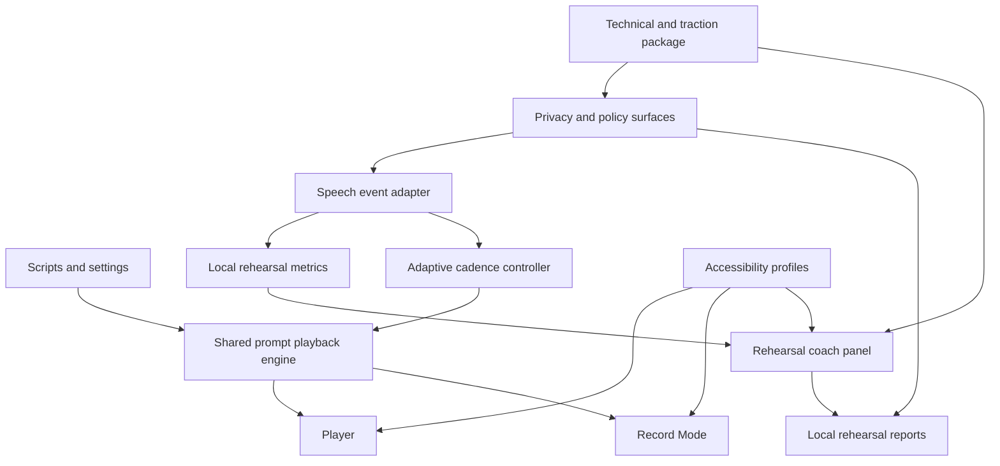
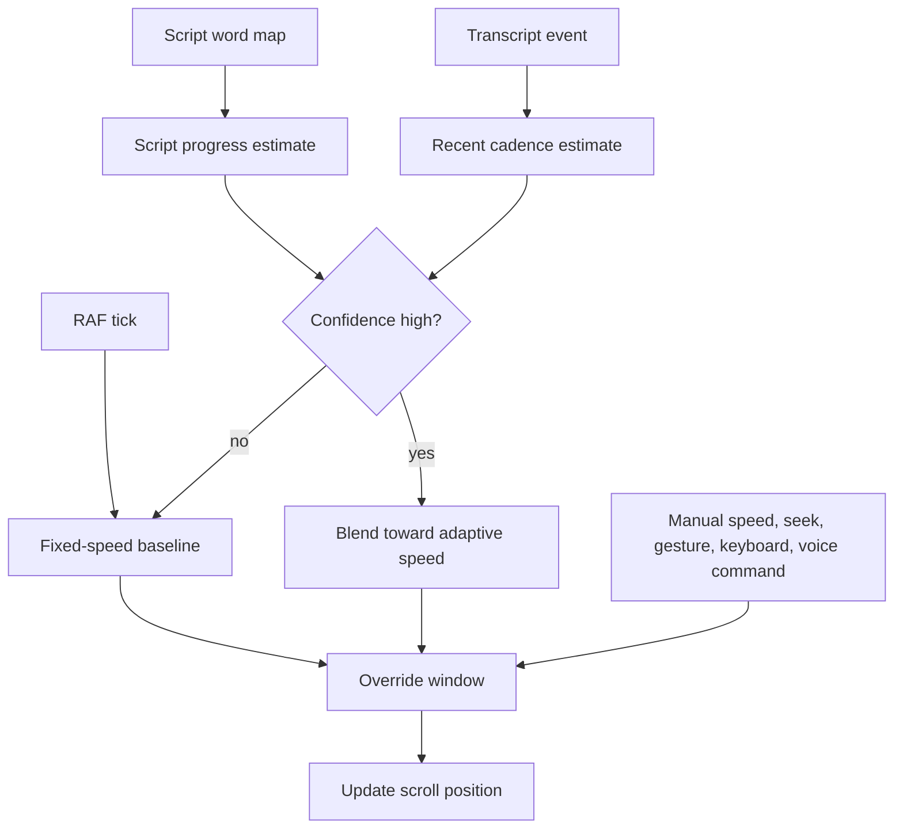
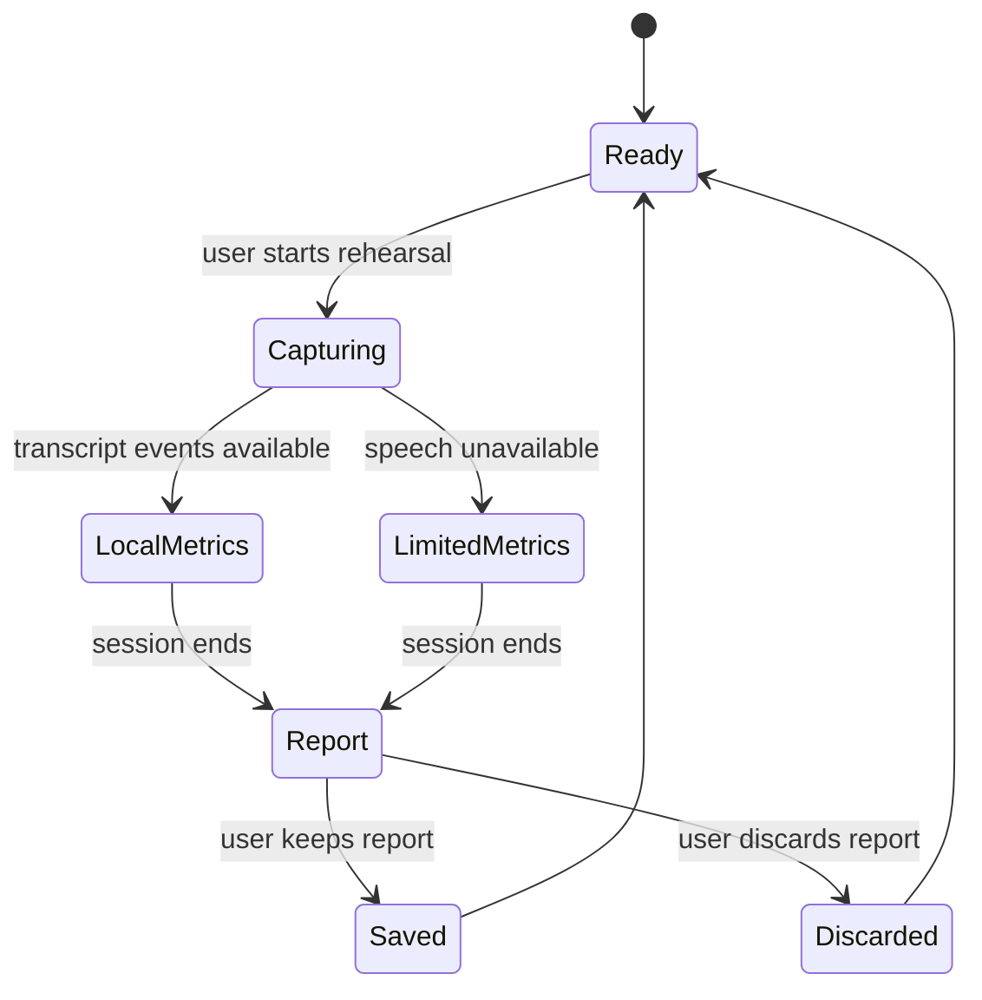

# feat: Ship Cuevora innovation release

## Summary

This plan turns Cuevora from a launchable offline teleprompter into a credible innovation release: adaptive voice-follow scrolling, local rehearsal feedback, accessibility-first prompting, and an evidence package that can support public launch, user traction, and Global Talent-style product storytelling.

The first execution slice stays local-first. Optional cloud AI, encrypted sync, producer control, and local speech-to-text models remain follow-up work until the privacy, policy, and device-performance constraints are proven.

---

## Problem Frame

Cuevora is close to a credible first production release. It already has local script storage, recording, camera overlay, gestures, voice commands, haptics, backup/restore, privacy documentation, Android packaging, and Play Store release notes. The current gap is not basic app completeness; it is proof that the product is meaningfully original and robust enough to put in users' hands.

The strongest next product story is a privacy-first rehearsal loop. Cuevora should listen to the speaker where supported, adapt scroll speed to their cadence, give useful local practice feedback, and document the architecture publicly. That creates a clearer innovation claim than "offline cross-platform teleprompter" while keeping production risk bounded.

---

## Requirements

### Production Readiness

- R1. Cuevora must preserve the current local-first behavior for scripts, settings, backups, recording, and guest use.
- R2. The release path must add manual Android QA coverage for recording, permissions, share/export, offline mode, large scripts, tablets or foldables, and low-memory devices.
- R3. Privacy, terms, Play Data Safety, signing, account deletion, and store-copy claims must match implemented behavior before public release.
- R4. The app must avoid claiming cloud sync, AI coaching, local STT, or producer control until those features are implemented and policy-reviewed.

### Adaptive Rehearsal

- R5. Cuevora must support adaptive scrolling where scroll speed follows recent spoken cadence when speech recognition is available and confidence is high.
- R6. Adaptive scrolling must fall back to the existing fixed-speed RAF behavior when recognition is unsupported, stale, low-confidence, disabled, or manually overridden.
- R7. Player and Record Mode must share one prompt playback engine so fixed-speed and adaptive behavior do not diverge.
- R8. Cuevora must create local rehearsal sessions with pacing, pause, filler-word, script-progress, and completion metrics.
- R9. Cuevora must provide useful rehearsal feedback even when speech recognition or camera access is unavailable.
- R10. Voice commands must remain available as command input and must not be broken by transcript-based rehearsal features.

### Privacy And Accessibility

- R11. Speech-based features must disclose that browser or platform speech recognition may use platform services, while Cuevora's own rehearsal metrics remain local by default.
- R12. Camera-based coaching must be opt-in, permission-gated, and disabled by default until device performance is proven.
- R13. Cuevora must add named accessibility profiles for dyslexia-friendly reading, low vision, high contrast, calm focus, caption-first rehearsal, and simplified controls.
- R14. Accessibility preferences must persist locally and apply consistently across Player, Record Mode, Settings, and rehearsal surfaces.

### Evidence And Traction

- R15. The release must include an evidence package: technical article, architecture notes, demo script, screenshots or clips, privacy model, and user-test feedback template.
- R16. The plan must create space for real-world proof: closed-test feedback, testimonials, usage observations, release notes, and externally shareable technical writing.
- R17. Bundle-size and runtime-performance risks must be measured before adding heavy ML or AI dependencies.

---

## Key Technical Decisions

- KTD1. Ship the first innovation slice around adaptive scrolling plus deterministic local rehearsal metrics. This is distinctive enough to strengthen the product story without turning the first release into a broad AI platform.
- KTD2. Extract prompt playback before adding adaptation. `src/pages/Player.tsx` and `src/pages/RecordMode.tsx` currently run separate RAF loops, so shared playback is the dependency that keeps behavior testable.
- KTD3. Treat Web Speech as a capability adapter, not a privacy guarantee. Cuevora should consume transcript events when supported, disclose platform behavior, and keep fixed-speed prompting fully functional.
- KTD4. Keep AI generation out of the first innovation release. Deterministic rehearsal feedback and script-timing guidance are enough for the first proof point; external AI providers can follow after explicit opt-in and policy copy exist.
- KTD5. Defer face-landmark eye-contact scoring unless the rest of the rehearsal loop is stable. It is potentially valuable but risks jank, extra dependency weight, and overclaiming.
- KTD6. Make accessibility profiles part of the rehearsal system, not just visual themes. The product story is stronger if accessibility affects prompting, captions, controls, and report presentation.
- KTD7. Treat documentation and user proof as implementation deliverables. For Global Talent positioning, code is weaker than code plus users, public technical writing, testimonials, and evidence of impact.
- KTD8. Put release hardening on the same plan as innovation. A standout feature does not help if signing, policy, account deletion, screenshots, QA, or store claims block launch.

---

## High-Level Technical Design

### Release Slice Topology

### Adaptive Scrolling Control Loop

### Rehearsal Session Lifecycle

---

## Phased Delivery

1. **Launch guardrails:** Resolve release signing, legal URLs, policy claims, account deletion posture, QA matrix, and store-copy constraints.
2. **Playback foundation:** Extract shared prompt playback and preserve current fixed-speed behavior in Player and Record Mode.
3. **Adaptive rehearsal MVP:** Add transcript events, adaptive scroll confidence, local metrics, captions, and reports.
4. **Accessibility and proof:** Add named accessibility profiles, evidence docs, demo assets, feedback capture, and performance/bundle measurement.
5. **Follow-up experiments:** Revisit cloud AI, face landmarks, producer control, encrypted sync, and local STT only after the MVP is stable.

---

## Implementation Units

### U1. Release Guardrails And Policy Cleanup

**Goal:** Make the existing app safe to ship for closed testing while preventing store, privacy, or signing claims from drifting ahead of implementation.

**Requirements:** R1, R2, R3, R4, R16

**Dependencies:** None

**Files:**

- `PLAY_STORE_RELEASE_CHECKLIST.md`
- `PRIVACY_DATA_INVENTORY.md`
- `STORE_LISTING_DRAFT.md`
- `README.md`
- `public/privacy.html`
- `android/keystore.properties.example`
- `android/app/build.gradle`

**Approach:** Update the release checklist around signing, account deletion, Play Data Safety, legal URLs, Firebase Android config, closed testing, screenshots, and explicit non-claims. Store copy should describe implemented teleprompter and recording capabilities now, and reserve rehearsal-coach claims for the innovation release.

**Patterns to follow:** Current checklist sections, existing privacy inventory style, and Android signing guardrails already present in the repo.

**Test scenarios:**

- Test expectation: none -- this unit is documentation and release configuration work, but reviewers should verify every claim against implemented behavior.

**Verification:** A release reviewer can tell what is launch-ready, what is blocked, and which claims must not appear in Play Console yet.

### U2. Shared Prompt Playback Engine

**Goal:** Extract fixed-speed scrolling, progress, seeking, reset, completion, and elapsed-time behavior into one reusable playback hook.

**Requirements:** R5, R6, R7, R10

**Dependencies:** None

**Files:**

- `src/hooks/use-prompt-playback.ts`
- `src/hooks/use-prompt-playback.test.ts`
- `src/pages/Player.tsx`
- `src/pages/RecordMode.tsx`
- `src/test/setup.ts`

**Approach:** Move RAF timing and scroll updates out of page components. The hook should accept the scroll container, speed, playback state, optional completion callback, and optional adaptive speed input. Player and Record Mode remain responsible for UI, camera, recording, gestures, keyboard shortcuts, and haptics.

**Execution note:** Add characterization tests for current fixed-speed behavior before changing page code.

**Patterns to follow:** Existing RAF loops in `src/pages/Player.tsx` and `src/pages/RecordMode.tsx`, haptic callbacks in `src/lib/haptics.ts`, and callback-ref style from `src/hooks/use-gesture-controls.ts`.

**Test scenarios:**

- Starting playback advances scroll position by speed and elapsed frame time.
- Pausing cancels animation and preserves scroll progress.
- Reset returns scroll position, elapsed time, and progress to zero.
- Seeking updates progress without requiring playback to be active.
- Reaching the end stops playback and calls the completion callback once.
- Player and Record Mode retain fixed-speed behavior after switching to the hook.

**Verification:** Fixed-speed prompting behaves the same in Player and Record Mode, but the scrolling code has one tested owner.

### U3. Speech Event Adapter And Voice Command Preservation

**Goal:** Convert speech recognition into reusable transcript events while preserving existing voice commands.

**Requirements:** R6, R8, R10, R11

**Dependencies:** U2

**Files:**

- `src/hooks/use-speech-events.ts`
- `src/hooks/use-speech-events.test.ts`
- `src/hooks/use-voice-control.ts`
- `src/hooks/use-voice-control.test.ts`
- `src/types/studio.ts`
- `src/pages/Player.tsx`
- `src/pages/RecordMode.tsx`
- `public/privacy.html`

**Approach:** Split speech capture from command parsing. The adapter should expose support state, listening state, interim/final transcript events, confidence, timestamps, and privacy capability copy. `use-voice-control.ts` should become a command consumer of the same event stream, not a parallel recognizer competing for the microphone.

**Patterns to follow:** Existing `useVoiceControl` support detection, Android-native unsupported handling, and current command map.

**Test scenarios:**

- A final transcript containing "pause" emits both a transcript event and the expected pause command.
- Interim results update caption state without triggering commands until final text is available.
- Unsupported recognition returns disabled capability state and does not throw.
- Android native builds keep speech disabled unless a supported path is added later.
- Recognition errors stop or restart according to the adapter policy without creating duplicate recognizers.
- Privacy copy distinguishes Cuevora-local metrics from browser or platform recognition services.

**Verification:** Voice commands still work where they worked before, and rehearsal features can consume transcript events from the same source.

### U4. Local Rehearsal Metrics And Reports

**Goal:** Store local rehearsal sessions and turn transcript timing into pacing, pause, filler-word, completion, and unavailable-metric feedback.

**Requirements:** R1, R8, R9, R11, R16

**Dependencies:** U3

**Files:**

- `src/types/studio.ts`
- `src/lib/rehearsal-metrics.ts`
- `src/lib/rehearsal-metrics.test.ts`
- `src/lib/storage.ts`
- `src/lib/storage.test.ts`
- `src/components/RehearsalCoachPanel.tsx`
- `src/components/RehearsalCoachPanel.test.tsx`
- `src/components/RehearsalReport.tsx`
- `src/components/RehearsalReport.test.tsx`
- `PRIVACY_DATA_INVENTORY.md`

**Approach:** Add versioned local data for rehearsal sessions without overloading `Script`. Metrics should be deterministic: WPM, long pauses, filler words, transcript coverage, session duration, and completion. The report should prefer clear "unavailable" states over fake zeroes when speech data is missing.

**Patterns to follow:** `normaliseScript`, `normaliseSettings`, `exportBackup`, `importBackup`, and existing storage tests.

**Test scenarios:**

- Transcript events with timestamps produce WPM, pause count, filler-word count, and duration.
- Empty transcript input produces unavailable speech metrics and still records session duration.
- A malformed imported rehearsal session is rejected without overwriting existing scripts.
- Exported backups include rehearsal sessions only as local user data.
- Clearing local data removes scripts, revisions, settings, and rehearsal sessions.
- A high pause count produces a concrete suggestion instead of a generic score.

**Verification:** A creator can finish rehearsal and see local, explainable feedback without sign-in or cloud AI.

### U5. Adaptive Voice-Follow Scrolling

**Goal:** Add adaptive scrolling that follows recent speaking cadence while preserving fixed-speed fallback and manual control.

**Requirements:** R5, R6, R7, R10, R17

**Dependencies:** U2, U3, U4

**Files:**

- `src/lib/adaptive-scroll.ts`
- `src/lib/adaptive-scroll.test.ts`
- `src/hooks/use-prompt-playback.ts`
- `src/pages/Player.tsx`
- `src/pages/RecordMode.tsx`
- `src/pages/Settings.tsx`
- `src/types/script.ts`

**Approach:** Build a pure adaptive-scroll controller that maps transcript cadence and script progress to a bounded target speed. Blend slowly toward the target and open an override window after manual speed, seek, gesture, keyboard, or voice commands. Persist an adaptive-scroll setting, default it off for the first release, and keep fixed-speed mode authoritative when confidence is weak.

**Patterns to follow:** Existing speed slider range, `getWordCount`, WPM read-time calculation, keyboard controls, gesture controls, and haptic feedback on speed changes.

**Test scenarios:**

- Faster-than-configured transcript cadence increases target speed within the configured bounds.
- Slower transcript cadence decreases target speed without reversing or stalling.
- Stale, missing, or low-confidence transcript data keeps fixed-speed scrolling active.
- Manual speed change disables adaptation for the override window.
- Progress near the end clamps scroll position and does not overscroll.
- Record Mode stops recording at script end when adaptive completion is reached.

**Verification:** Adaptive mode feels responsive, but a user can always regain predictable fixed-speed control.

### U6. Rehearsal UX And Accessibility Profiles

**Goal:** Add the visible rehearsal and accessibility surfaces that make the adaptive-coach loop usable by creators.

**Requirements:** R8, R9, R13, R14, R15

**Dependencies:** U4, U5

**Files:**

- `src/pages/Rehearsal.tsx`
- `src/components/RehearsalCoachPanel.tsx`
- `src/components/RehearsalReport.tsx`
- `src/lib/accessibility-profiles.ts`
- `src/lib/accessibility-profiles.test.ts`
- `src/components/AccessibilityProfileSelector.tsx`
- `src/components/AccessibilityProfileSelector.test.tsx`
- `src/pages/Home.tsx`
- `src/pages/Player.tsx`
- `src/pages/RecordMode.tsx`
- `src/pages/Settings.tsx`
- `src/App.tsx`
- `src/index.css`

**Approach:** Add a rehearsal entry point that can run with or without recording. Show live caption state, pacing, pause feedback, filler words, and report summaries. Add named accessibility profiles that map to typography, spacing, contrast, captions, reduced motion, focus-line behavior, and simplified controls.

**Patterns to follow:** Route declarations in `src/App.tsx`, card/list patterns in Home, Player overlay controls, `PLAYER_THEMES`, and settings update events.

**Test scenarios:**

- Starting rehearsal without camera permission still captures speech metrics when speech is available.
- Unsupported speech recognition shows limited coaching and keeps prompting usable.
- Ending rehearsal creates a report linked to the script.
- Selecting low vision increases prompt text size, line spacing, control size, and contrast across Player and Record Mode.
- Selecting dyslexia-friendly spacing changes presentation without mutating script content.
- Caption-first mode enables captions when supported and shows fallback text when unsupported.
- Reduced-motion preference disables nonessential rehearsal transitions.

**Verification:** A creator can rehearse, receive feedback, adjust accessibility support, and repeat without recording or signing in.

### U7. Performance, Bundle, And Device QA Gates

**Goal:** Prove the innovation release does not degrade the production-ready baseline.

**Requirements:** R2, R6, R12, R17

**Dependencies:** U2, U3, U5, U6

**Files:**

- `vite.config.ts`
- `PLAY_STORE_RELEASE_CHECKLIST.md`
- `docs/qa/android-closed-test-matrix.md`
- `docs/qa/performance-notes.md`
- `README.md`

**Approach:** Add explicit QA gates for scroll smoothness, adaptive mode fallback, recording, share/export, large scripts, offline mode, low-memory devices, tablets or foldables, and permissions. Record bundle-size notes and decide whether code splitting is needed before adding ML, charting, or AI dependencies.

**Patterns to follow:** Existing Play Store release checklist and README release-readiness section.

**Test scenarios:**

- Test expectation: none -- this unit is QA documentation and build-analysis work, but reviewers should verify the matrix was run and bundle-size findings are recorded.

**Verification:** The release has a reproducible closed-test checklist and a written performance/bundle decision.

### U8. Evidence Package And Public Product Story

**Goal:** Create external-facing artifacts that make Cuevora's originality, privacy posture, and technical contribution legible.

**Requirements:** R15, R16

**Dependencies:** U1, U2, U4, U5, U6, U7

**Files:**

- `docs/technical/60fps-offline-teleprompter.md`
- `docs/technical/adaptive-rehearsal-coach.md`
- `docs/technical/privacy-first-architecture.md`
- `docs/technical/demo-script.md`
- `docs/feedback/closed-test-feedback-template.md`
- `README.md`
- `STORE_LISTING_DRAFT.md`

**Approach:** Publish a technical narrative only after the feature exists. The package should explain RAF scrolling, adaptive cadence control, local rehearsal metrics, privacy boundaries, accessibility design, release QA, and user feedback capture. It should avoid visa/legal claims and focus on demonstrable product evidence.

**Patterns to follow:** README architecture section, release checklist style, screenshot documentation, and privacy inventory language.

**Test scenarios:**

- Test expectation: none -- this unit is documentation and evidence work, but reviewers should verify claims, links, screenshots, and demo steps against implemented behavior.

**Verification:** A reviewer can understand what is novel, how it works, what was tested, and what user evidence exists.

---

## Acceptance Examples

- AE1. Given speech recognition is supported, when a creator rehearses a 600-word script, then Cuevora shows WPM, long pauses, filler words, script completion, captions, and concrete local suggestions.
- AE2. Given speech recognition is unsupported, when rehearsal starts, then fixed-speed prompting still works and Cuevora explains which metrics are unavailable.
- AE3. Given adaptive scrolling is enabled and the speaker slows down, when confidence remains high, then scroll speed slows gradually without jumping.
- AE4. Given a user manually changes speed during adaptive playback, when the command is applied, then adaptation pauses for an override window and fixed control wins.
- AE5. Given the user chooses a dyslexia-friendly profile, when they open Player, Record Mode, or Rehearsal, then text presentation and control density reflect the profile without changing script content.
- AE6. Given the app is prepared for Play closed testing, when a reviewer checks store copy and privacy docs, then no unimplemented AI, sync, producer, or local-STT claim appears.
- AE7. Given the innovation release is complete, when a reader opens the evidence package, then they can trace the product claim to implemented behavior, QA notes, screenshots or clips, and feedback capture.

---

## Scope Boundaries

### In Scope

- Shared playback engine for Player and Record Mode.
- Speech event adapter that preserves current voice commands.
- Local rehearsal metrics, reports, captions, and unavailable states.
- Adaptive voice-follow scrolling with fixed-speed fallback.
- Accessibility profiles across prompting and rehearsal surfaces.
- Play Store readiness, privacy copy, QA matrix, and evidence package.

### Deferred To Follow-Up Work

- Cloud AI script rewriting or rehearsal coaching.
- Local speech-to-text model bundling or model download.
- Face-landmark eye-contact scoring.
- Producer remote-control pairing and WebRTC transport.
- Encrypted cloud sync, conflict resolution, and self-service account deletion.
- Team accounts, subscriptions, analytics dashboards, or billing.
- Native Android ML plugins if WebView performance is insufficient.

### Outside This Product Identity

- Making cloud AI mandatory for prompting, rehearsal, or script creation.
- Selling recordings, transcripts, scripts, or rehearsal data for training.
- Adding advertising SDKs or default analytics tracking.
- Representing legal or visa eligibility as guaranteed by app features.

---

## System-Wide Impact

- **Performance:** Adaptive calculations must stay outside the render hot path, and fixed RAF scrolling must remain smooth on Android.
- **Privacy:** Speech, rehearsal reports, backups, Firebase auth, and future AI/sync boundaries need visible capability state and consistent policy copy.
- **Data lifecycle:** Rehearsal sessions expand backup, restore, clear-local-data, and privacy inventory behavior.
- **Cross-platform behavior:** Android WebView, desktop browsers, and PWA mode differ for Web Speech, MediaRecorder, Wake Lock, Web Crypto, and file sharing.
- **Testing:** Current coverage is thin for the app size. This plan adds pure logic tests for engines, hook tests for playback/speech, and component tests for rehearsal/accessibility states.
- **Product evidence:** Technical writing and feedback artifacts become part of the release surface, not afterthoughts.

---

## Risks And Mitigations

- **Adaptive scrolling feels wrong:** Default it off initially, blend speed changes gradually, preserve manual override, and keep fixed speed as a one-tap fallback.
- **Speech recognition support varies:** Gate transcript features behind capability detection and make unavailable states clear.
- **Platform speech weakens privacy claims:** Say Cuevora metrics are local by default, but browser or platform recognition may involve platform services.
- **The scope becomes too broad:** Keep AI generation, face landmarks, producer mode, and sync in follow-up unless the MVP proves stable.
- **Bundle size grows:** Avoid heavy ML dependencies in the first slice and record bundle findings before adding new large packages.
- **Release blocked by policy:** Resolve signing, legal URLs, Play Data Safety, account deletion, and Firebase Android config before public launch.
- **Visa story overclaims innovation:** Frame public artifacts around demonstrated technical work, users, testimonials, and recognition rather than guaranteed immigration outcomes.

---

## Documentation And Operational Notes

- Update `PRIVACY_DATA_INVENTORY.md` before enabling speech-derived rehearsal storage, adaptive metrics, or any future AI/sync provider.
- Update `public/privacy.html` before exposing rehearsal features that depend on browser or platform speech recognition.
- Keep `STORE_LISTING_DRAFT.md` aligned with implemented behavior; do not claim AI coaching, local STT, sync, or producer mode until shipped.
- Add closed-test screenshots and feedback summaries only after real device testing.
- Publish technical content after implementation so claims can be backed by screenshots, clips, test notes, and code references.

---

## Sources And Research

- Codebase: `README.md`, `src/pages/Player.tsx`, `src/pages/RecordMode.tsx`, `src/hooks/use-voice-control.ts`, `src/hooks/use-gesture-controls.ts`, `src/lib/storage.ts`, `src/lib/sync-service.ts`, `PRIVACY_DATA_INVENTORY.md`, `PLAY_STORE_RELEASE_CHECKLIST.md`, `STORE_LISTING_DRAFT.md`.
- Existing verification context from the user: `npm run lint`, `npm run test`, and `npm run build` pass; current tests are thin; the main JS chunk is large at about 701 kB.
- GOV.UK digital technology Global Talent route context from the user: evidence needs leadership or potential leadership, innovation, contribution, recognition, and commercial or sector impact; Cuevora should support the case through demonstrated product evidence rather than app existence alone.
- MDN Web Speech API: speech recognition can depend on browser or platform services and must not be assumed to be private local STT. https://developer.mozilla.org/en-US/docs/Web/API/Web_Speech_API
- MDN MediaRecorder: recording support is broad but MIME types and behavior vary by browser. https://developer.mozilla.org/en-US/docs/Web/API/MediaRecorder
- W3C WCAG 2.2: accessibility work should be checked against established web accessibility criteria. https://www.w3.org/TR/WCAG22/
