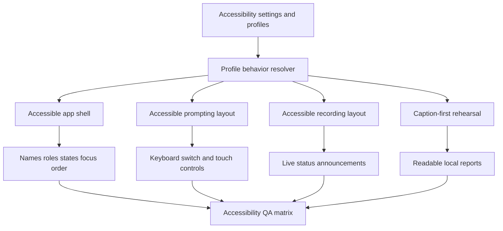
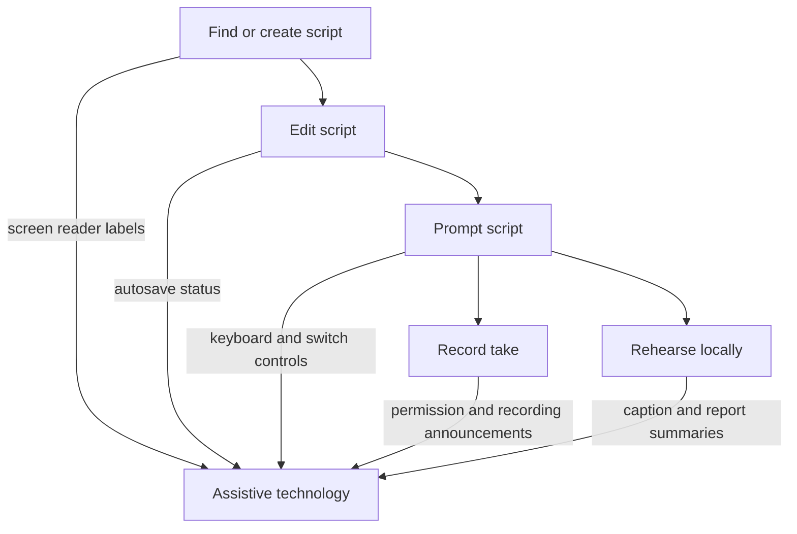

# feat: Make Cuevora accessibility-ready

## Summary

This plan makes Cuevora meaningfully usable by disabled people across visual, motor, hearing/speech, cognitive, and assistive-technology needs. It builds on the existing accessibility profiles, keyboard shortcuts, voice controls, haptics, captions, high-contrast theme, and adjustable teleprompter typography, then closes the larger gaps around screen-reader semantics, switch/keyboard access, reduced motion, non-pointer operation, caption/transcript access, accessible recording, and repeatable accessibility QA.

---

## Problem Frame

Cuevora is a teleprompter and recording app, so accessibility is not a side setting. The core product depends on reading moving text, controlling playback under timing pressure, managing camera and microphone permissions, recording, editing long scripts, and recovering from mistakes. These tasks can fail for people who use screen readers, switch devices, hardware keyboards, Voice Access, high magnification, captions, reduced motion, or simplified interfaces.

The app already has a useful base: `AccessibilityProfile`, high-contrast theme, font and line-spacing controls, focus line, haptics toggles, gesture and keyboard controls, voice controls, adaptive scrolling, and local rehearsal captions. The next step is to turn those individual capabilities into an accessibility-ready product posture with explicit interaction alternatives and evidence from assistive-technology testing.

---

## Requirements

**Assistive Technology**

- R1. Every interactive control in Home, Editor, Player, Record Mode, Rehearsal, Settings, onboarding, login, dialogs, toasts, and empty states must expose a meaningful accessible name, role, state, and purpose.
- R2. Dynamic state changes such as autosave, recording state, playback state, countdown, permission errors, import/export results, deleted/restored scripts, and rehearsal availability must be announced without requiring visual inspection.
- R3. Decorative icons, progress visuals, camera previews, focus-line overlays, and purely visual markers must not create redundant or confusing screen-reader output.
- R4. Route changes and modal transitions must move focus predictably to the new screen or dialog heading.

**Input Accessibility**

- R5. Cuevora must support core workflows without gestures, drag, pinch, or precise touch.
- R6. Hardware keyboard and switch-style navigation must reach every actionable control in a sensible order without traps.
- R7. Voice Access users must be able to target controls by visible labels that match accessible names.
- R8. Gesture, voice, haptic, camera, and microphone features must remain optional and have visible alternatives.

**Prompting And Recording**

- R9. Player and Record Mode must provide an accessible controls layout that exposes large, labeled controls for play/pause, rewind, forward, reset, speed, font size, theme, recording, camera, mirror, split view, and exit.
- R10. Moving and animated prompting surfaces must respect reduced-motion preferences and provide pause/stop/manual-scroll paths.
- R11. Low-vision prompting must support larger text, high contrast, spacing, focus guidance, and magnification-friendly layouts without text clipping or control overlap.
- R12. Users who are deaf, hard of hearing, or speech-disabled must be able to rehearse and record without depending on voice commands or audio-only cues.
- R13. Recording completion, save/share outcomes, permission denial, and unsupported browser/device states must be communicated visually and through assistive technology.

**Cognitive And Learning Accessibility**

- R14. Accessibility profiles must become functional presets that change control density, motion, captions, contrast, target size, and prompting layout, not only text styling.
- R15. Simple Controls mode must reduce on-screen control complexity while preserving access to essential commands.
- R16. Error messages and destructive confirmations must use plain language and provide recoverable paths where possible.

**Quality And Evidence**

- R17. The release must include an accessibility QA matrix covering TalkBack, Switch Access, Voice Access, hardware keyboard, large text, high contrast, reduced motion, screen magnification, portrait/landscape, tablets/foldables, and Android Accessibility Scanner.
- R18. Automated tests must cover semantic labels, profile behavior, keyboard-accessible flows, live announcements, and fallback paths for disabled capabilities.
- R19. Store copy and documentation may claim accessibility improvements only for implemented and tested behaviors.
- R20. Accessibility readiness means practical WCAG/mobile alignment and evidence, not a formal legal certification claim.

---

## Key Technical Decisions

- KTD1. Target WCAG 2.2 AA-inspired readiness without claiming certification. WCAG 2.2 is the current W3C Recommendation and applies across devices, but formal conformance claims require a broader audit than this plan can honestly guarantee.
- KTD2. Treat accessibility profiles as behavior presets. Existing profile fields such as `highContrast`, `reducedMotion`, `captionsPreferred`, and `simplifiedControls` should actively drive UI structure and interaction behavior.
- KTD3. Prefer semantic HTML and existing Radix/shadcn primitives before adding custom ARIA. Cuevora is a React web app wrapped by Capacitor, so the accessibility tree should come from native controls, labels, roles, focus management, and status regions wherever possible.
- KTD4. Make pointer gestures progressive enhancement. Gestures, pinch, drag, and camera overlays can remain valuable, but every core action needs button, keyboard, and switch-access alternatives.
- KTD5. Use visible labels for accessibility-critical controls. Voice Access and cognitive accessibility are stronger when the visible text matches the accessible name; icon-only buttons should stay only where space demands it and must have clear labels or tooltips.
- KTD6. Keep accessibility features local-first. Captions, rehearsal metrics, profile preferences, and QA evidence should not introduce new analytics or cloud-processing claims.
- KTD7. Stage QA with assistive technologies, not only linting. Automated checks catch labels and contrast; TalkBack, Switch Access, Voice Access, hardware keyboard, and large-text testing catch workflow failures.

---

## High-Level Technical Design

### Accessibility Capability Layers



### Core Workflow Coverage



### Accessibility State Model

```mermaid
stateDiagram-v2
  [*] --> Default
  Default --> ProfileApplied: user selects profile
  ProfileApplied --> AccessiblePrompting: opens Player
  ProfileApplied --> AccessibleRecording: opens Record Mode
  ProfileApplied --> AccessibleRehearsal: opens Rehearsal
  AccessiblePrompting --> FallbackControls: gestures or speech unavailable
  AccessibleRecording --> PermissionRecovery: camera or mic denied
  AccessibleRehearsal --> LimitedFeedback: speech recognition unavailable
  FallbackControls --> AccessiblePrompting
  PermissionRecovery --> AccessibleRecording
  LimitedFeedback --> AccessibleRehearsal
```

---

## Scope Boundaries

### In Scope

- WCAG 2.2 AA-inspired semantics, keyboardability, focus management, reduced motion, contrast, target size, and understandable-status improvements.
- Android assistive-technology validation for TalkBack, Switch Access, Voice Access, Accessibility Scanner, and Play pre-launch accessibility reports.
- Web validation with keyboard navigation, screen-reader spot checks, large text, high contrast, and reduced motion.
- Functional profile behavior for low vision, dyslexia-friendly prompting, calm focus, caption-first rehearsal, and simple controls.

### Deferred to Follow-Up Work

- Human accessibility audit by certified specialists.
- User research with disabled creators, speakers, educators, and presenters.
- Sign language overlays, real-time translation, or professional caption editing.
- Native Android accessibility plugin work beyond what Capacitor WebView and semantic HTML expose.
- AI-based diagnosis or medical-style disability recommendations.

### Outside This Product's Identity

- Claims that Cuevora treats, diagnoses, or corrects a disability.
- Mandatory account creation or cloud processing as a prerequisite for accessibility.
- Accessibility features that make offline prompting, privacy, or simple recording materially worse.

---

## Implementation Units

### U1. Accessibility Semantics Foundation

**Goal:** Give the app a consistent semantic foundation so assistive technologies can understand screens, controls, states, and route changes.

**Requirements:** R1, R2, R3, R4, R7, R18

**Dependencies:** None

**Files:**

- `src/components/AccessibleStatus.tsx`
- `src/components/PageShell.tsx`
- `src/components/ui/button.tsx`
- `src/components/ui/slider.tsx`
- `src/components/ui/switch.tsx`
- `src/App.tsx`
- `src/pages/Home.tsx`
- `src/pages/Editor.tsx`
- `src/pages/Player.tsx`
- `src/pages/RecordMode.tsx`
- `src/pages/Rehearsal.tsx`
- `src/pages/Settings.tsx`
- `src/pages/Login.tsx`
- `src/pages/Onboarding.tsx`
- `src/test/accessibility-helpers.tsx`
- `src/components/AccessibleStatus.test.tsx`
- `src/pages/Home.accessibility.test.tsx`
- `src/pages/Editor.accessibility.test.tsx`
- `src/pages/Settings.accessibility.test.tsx`

**Approach:** Add a small shared accessibility layer instead of scattering one-off fixes. Introduce a live status component for polite/assertive announcements, a page-shell pattern for headings and focus targets, and shared helper conventions for icon buttons, sliders, switches, dialog headings, and destructive actions. Audit pages for missing `aria-label`, `aria-labelledby`, `aria-describedby`, pressed/expanded/current state, decorative icon hiding, and visible-label/accessibility-name mismatch.

**Patterns to follow:** Existing Radix/shadcn components in `src/components/ui/`, icon-button `aria-label` patterns in `src/pages/Editor.tsx`, route structure in `src/App.tsx`, and toast/status usage in `src/pages/Home.tsx` and `src/pages/Editor.tsx`.

**Test scenarios:**

- Home script cards expose separate accessible actions for edit/open, play, rehearse, and delete without relying on card click only.
- Editor announces autosave states when content changes from saving to saved, offline, or error.
- Settings profile selector exposes each profile as a named selectable option with current selection state.
- Icon-only buttons have accessible names that match their visible intent and do not include redundant words like "button".
- Decorative icons and progress visuals are hidden from the accessibility tree.
- Route navigation moves focus to the new page heading or main region.

**Verification:** A keyboard and screen-reader user can identify the current page, navigate to major actions, understand changing status, and avoid duplicate decorative announcements.

### U2. Keyboard, Switch, And Voice Access Control Paths

**Goal:** Ensure users can complete core workflows without touch gestures, drag, pinch, or speech input.

**Requirements:** R5, R6, R7, R8, R9, R10, R18

**Dependencies:** U1

**Files:**

- `src/hooks/use-accessible-shortcuts.ts`
- `src/hooks/use-accessible-shortcuts.test.ts`
- `src/components/AccessibleControlsPanel.tsx`
- `src/components/AccessibleControlsPanel.test.tsx`
- `src/pages/Home.tsx`
- `src/pages/Editor.tsx`
- `src/pages/Player.tsx`
- `src/pages/RecordMode.tsx`
- `src/pages/Rehearsal.tsx`
- `src/pages/Settings.tsx`

**Approach:** Promote existing keyboard shortcuts into a discoverable, testable control model. Add an accessible controls panel for Player and Record Mode that exposes all essential commands as large labeled buttons. Make script-card actions reachable without opening context menus. Ensure shortcut handlers do not fire while typing in inputs or textareas. Align visible button text with accessible names so Android Voice Access can target controls naturally.

**Patterns to follow:** Existing keyboard handling in `src/pages/Player.tsx`, `useGestureControls` separation in `src/hooks/use-gesture-controls.ts`, shared playback behavior in `src/hooks/use-prompt-playback.ts`, and large touch targets already expressed through the `touch-target` class.

**Test scenarios:**

- Pressing Tab from the top of Player reaches back, home, playback, speed, font, theme, recording, voice, focus-line, gesture, start, end, and reload controls in a sensible order.
- Space and Enter activate focused controls without triggering duplicate playback changes.
- Player shortcut keys do not run while the user is editing a text field, search field, tag input, or textarea.
- A switch-style user can reach and activate Start Recording, Stop Recording, Save Video, Dismiss, and Back in Record Mode.
- Voice Access can target visible labels such as "Start Recording", "Pause", "Speed", "Font", "Theme", and "Save Video".
- Gesture-disabled settings still leave rewind, forward, speed, font, reset, and play/pause available.

**Verification:** The main create-edit-prompt-record-rehearse workflow is possible with keyboard-only and switch-style navigation.

### U3. Functional Accessibility Profiles

**Goal:** Turn accessibility profiles into behavior-driving presets that adjust layout, motion, controls, captions, target size, and contrast across the app.

**Requirements:** R10, R11, R12, R14, R15, R18

**Dependencies:** U1, U2

**Files:**

- `src/lib/accessibility-profiles.ts`
- `src/lib/accessibility-profiles.test.ts`
- `src/types/script.ts`
- `src/components/AccessibilityProfileSelector.tsx`
- `src/components/AccessibilityProfileSelector.test.tsx`
- `src/components/AccessibleControlsPanel.tsx`
- `src/pages/Player.tsx`
- `src/pages/RecordMode.tsx`
- `src/pages/Rehearsal.tsx`
- `src/pages/Settings.tsx`
- `src/index.css`

**Approach:** Extend profile configuration to include target-size scale, control density, motion preference, captions preference, contrast intent, prompt layout, and optional auto-show controls. Apply profile settings through shared resolvers so Player, Record Mode, and Rehearsal behave consistently. Add profile descriptions that explain outcomes without disability stereotypes.

**Patterns to follow:** Current `ACCESSIBILITY_PROFILES`, `applyProfileFontSize`, `applyProfileLineSpacing`, existing settings persistence in `src/lib/storage.ts`, and theme definitions in `src/types/script.ts`.

**Test scenarios:**

- Low Vision profile enforces larger prompt text, larger controls, high-contrast-compatible presentation, and non-overlapping bottom controls.
- Calm Focus profile disables non-essential entrance/exit animations and keeps controls visible without sudden auto-hide.
- Caption-first profile makes transcript/caption status prominent in Rehearsal and Player when speech events are available.
- Simple Controls profile reduces default visible controls while preserving access through the accessible controls panel.
- Dyslexia-friendly profile increases spacing and line rhythm without clipping script lines.
- Switching profiles persists locally and updates Player, Record Mode, Rehearsal, and Settings after navigation.

**Verification:** Each profile changes real behavior in at least one core workflow and remains reversible from Settings.

### U4. Accessible Prompting And Recording Modes

**Goal:** Make the most demanding surfaces, Player and Record Mode, usable for low-vision, motor-impaired, screen-reader, and reduced-motion users.

**Requirements:** R5, R8, R9, R10, R11, R12, R13, R15, R18

**Dependencies:** U1, U2, U3

**Files:**

- `src/pages/Player.tsx`
- `src/pages/RecordMode.tsx`
- `src/hooks/use-prompt-playback.ts`
- `src/hooks/use-prompt-playback.test.ts`
- `src/components/AccessibleControlsPanel.tsx`
- `src/components/RecordingStatus.tsx`
- `src/components/RecordingStatus.test.tsx`
- `src/index.css`
- `src/pages/Player.accessibility.test.tsx`
- `src/pages/RecordMode.accessibility.test.tsx`

**Approach:** Add a control-dense accessible layout that can be selected by profile or toggled in-session. Keep all playback and recording commands visible, labeled, and keyboard/switch reachable. Provide reduced-motion alternatives for countdowns, listening indicators, recording pulses, panel slides, and gesture guides. Add live status announcements for recording start/stop, permission errors, save/share progress, and playback completion.

**Patterns to follow:** Shared playback hook in `src/hooks/use-prompt-playback.ts`, media permission handling in `src/pages/RecordMode.tsx`, the existing gesture guide in `src/pages/Player.tsx`, and error-copy patterns in missing-script states.

**Test scenarios:**

- Reduced-motion mode removes scale/slide animations from countdown, controls, gesture guide, and recording overlays.
- Countdown changes are announced without requiring a user to see the large number.
- Recording start, active duration, stop, save started, save succeeded, and save failed states produce accessible status text.
- Camera or microphone denial gives a focused error path with Retry and Back reachable by keyboard.
- Player can pause, reset, seek, change speed, and change font size without gestures or pointer drag.
- Record Mode can save or dismiss a completed recording with screen-reader-friendly labels and focus placement.
- Prompt text remains readable at the largest profile-supported size on mobile and tablet viewports.

**Verification:** A user can run prompting and recording with keyboard/switch controls, reduced motion, and large text without losing access to critical actions.

### U5. Caption, Transcript, And Rehearsal Accessibility

**Goal:** Make rehearsal feedback useful for people who cannot rely on audio, speech commands, or visual-only reports.

**Requirements:** R2, R8, R12, R13, R14, R16, R18

**Dependencies:** U1, U3

**Files:**

- `src/pages/Rehearsal.tsx`
- `src/components/RehearsalCoachPanel.tsx`
- `src/components/RehearsalCoachPanel.test.tsx`
- `src/components/RehearsalReport.tsx`
- `src/components/RehearsalReport.test.tsx`
- `src/hooks/use-speech-events.ts`
- `src/hooks/use-speech-events.test.ts`
- `src/types/studio.ts`
- `src/lib/rehearsal-metrics.ts`
- `src/lib/rehearsal-metrics.test.ts`

**Approach:** Treat speech recognition as optional input, not as an accessibility requirement. Improve Rehearsal so unsupported speech recognition produces a clear limited-feedback state. Add transcript/caption regions with stable headings, readable summaries, and report sections that are navigable by assistive technology. Make metrics understandable without color-only signals or chart-only output.

**Patterns to follow:** Existing speech capability object in `src/hooks/use-speech-events.ts`, local metrics in `src/lib/rehearsal-metrics.ts`, and report components created for the rehearsal coach.

**Test scenarios:**

- When speech recognition is unsupported, Rehearsal explains which metrics are unavailable and still lets the user practice manually.
- Latest transcript updates are announced politely and do not interrupt every interim recognition event.
- Rehearsal report sections expose headings for pace, pauses, filler words, script coverage, unavailable metrics, and suggestions.
- Metrics are conveyed by text, not only color, icon, or progress bar.
- Caption-first profile makes transcript and unavailable-metric states more prominent.
- Saving a rehearsal report confirms local-only storage through accessible status text.

**Verification:** Rehearsal remains useful with and without speech recognition and does not exclude users who cannot speak commands.

### U6. Accessible Editor, Script Library, And Data Flows

**Goal:** Make script creation, editing, import/export, search, filtering, deletion, restore, backup, and account/legal flows accessible and recoverable.

**Requirements:** R1, R2, R4, R5, R6, R7, R16, R18

**Dependencies:** U1, U2

**Files:**

- `src/pages/Home.tsx`
- `src/pages/Editor.tsx`
- `src/pages/Settings.tsx`
- `src/components/ui/dialog.tsx`
- `src/components/ui/dropdown-menu.tsx`
- `src/components/ui/alert-dialog.tsx`
- `src/pages/Home.accessibility.test.tsx`
- `src/pages/Editor.accessibility.test.tsx`
- `src/pages/Settings.accessibility.test.tsx`

**Approach:** Replace clickable non-button containers with semantic buttons or nested actions that preserve clear focus behavior. Add labels and descriptions for search, filters, tags, revision restore, import/export, backup/restore, account deletion request, and clear-local-data actions. Ensure destructive flows announce consequences and post-action recovery options such as Undo.

**Patterns to follow:** Alert dialog pattern in `src/pages/RecordMode.tsx`, toast undo pattern in `src/pages/Home.tsx`, autosave state in `src/pages/Editor.tsx`, and backup/restore actions in `src/pages/Settings.tsx`.

**Test scenarios:**

- Script cards are reachable and understandable by screen reader and keyboard users without relying on pointer-only card clicks.
- Search and tag filters announce empty states and result counts after changes.
- Deleting a script announces deletion and exposes Undo as an accessible action.
- Revision history entries are buttons with date and preview text, and restoring a revision announces success.
- Import and export controls expose file type expectations and result status.
- Clear Local Data and account deletion request flows communicate consequences before action.

**Verification:** A user can create, find, edit, delete/restore, import/export, and back up scripts using keyboard and assistive technology.

### U7. Accessibility QA Matrix And Release Evidence

**Goal:** Create durable accessibility validation evidence so the app can honestly claim implemented accessibility improvements.

**Requirements:** R17, R18, R19, R20

**Dependencies:** U1, U2, U3, U4, U5, U6

**Files:**

- `docs/qa/accessibility-test-matrix.md`
- `docs/qa/android-closed-test-matrix.md`
- `PLAY_STORE_RELEASE_CHECKLIST.md`
- `STORE_LISTING_DRAFT.md`
- `README.md`
- `PRIVACY_DATA_INVENTORY.md`
- `public/privacy.html`
- `package.json`

**Approach:** Add a repeatable QA matrix with device, viewport, input, assistive-technology, and profile coverage. Include TalkBack linear navigation, TalkBack explore-by-touch, Switch Access group selection, Voice Access command targeting, hardware keyboard, large text, high contrast, reduced motion, Accessibility Scanner, Play pre-launch report review, and web keyboard testing. Update release copy to claim only validated behavior.

**Patterns to follow:** Existing `docs/qa/android-closed-test-matrix.md`, Play Store checklist style, privacy inventory structure, and release evidence docs from the innovation plan.

**Test scenarios:**

- Test expectation: documentation and release evidence only, but the matrix must define pass/fail criteria for each assistive-technology workflow.

**Verification:** A release reviewer can see what was tested, which disabilities/use cases were considered, what passed, and which accessibility claims are safe for store copy.

---

## Acceptance Examples

- AE1. Given TalkBack is enabled on Android, when a user opens Home and swipes through controls, then each script, action, filter, and empty state is announced with a meaningful purpose.
- AE2. Given a user cannot use gestures, when they open Player, then they can play, pause, rewind, forward, reset, change speed, change font size, and exit using keyboard or switch navigation.
- AE3. Given reduced motion is enabled, when countdown, controls, recording indicators, and modal overlays appear, then the app avoids non-essential scale/slide motion and still communicates state.
- AE4. Given camera or microphone permission is denied, when a user starts recording, then the error is focused or announced and Retry and Back are reachable.
- AE5. Given speech recognition is unavailable, when a user starts Rehearsal, then Cuevora explains limited feedback and still allows practice without voice commands.
- AE6. Given Low Vision profile is selected, when a user opens Player or Record Mode, then large text and controls remain readable without overlap on mobile and tablet viewports.
- AE7. Given a script is deleted, when the toast appears, then the deletion and Undo action are accessible without relying on visual-only feedback.

---

## System-Wide Impact

This work changes the app's accessibility contract across every user-facing route. It will affect shared UI primitives, route focus behavior, toast/status handling, player control density, recording overlays, settings persistence, QA documentation, and store claims. It should be treated as product hardening, not a cosmetic pass.

---

## Risks & Dependencies

- **Capacitor WebView accessibility differences:** Android TalkBack behavior may differ from desktop browser screen readers. Mitigation: validate on real Android devices with TalkBack, Switch Access, and Voice Access.
- **Motion and controls can conflict:** Reducing motion and keeping controls visible may change the current immersive teleprompter feel. Mitigation: make it profile-driven and reversible.
- **Large text can break dense controls:** Prompting and recording surfaces are space-constrained. Mitigation: test largest supported profile sizes on mobile, tablet, and foldable layouts.
- **Speech recognition is not universal:** Web Speech support varies and can involve platform services. Mitigation: keep speech optional and disclose capability limits.
- **Automated tests are insufficient:** Accessibility Scanner and DOM tests will miss workflow friction. Mitigation: require manual assistive-technology matrix evidence before store claims.

---

## Documentation And Operational Notes

- Update `README.md` to describe implemented accessibility workflows without overclaiming certification.
- Update `STORE_LISTING_DRAFT.md` only after QA evidence exists for the exact accessibility claims.
- Update `PLAY_STORE_RELEASE_CHECKLIST.md` with accessibility QA as a release blocker before public launch.
- Update `PRIVACY_DATA_INVENTORY.md` and `public/privacy.html` only if accessibility features change stored settings, speech/caption behavior, or recording metadata.
- Keep accessibility QA artifacts under `docs/qa/` so closed testers and reviewers can repeat the same checks.

---

## Sources And Research

- W3C WCAG 2.2 says the guidelines cover disabilities including blindness/low vision, deafness/hearing loss, limited movement, speech disabilities, photosensitivity, and cognitive/learning limitations, and apply across devices including mobile devices: https://www.w3.org/TR/WCAG22/
- W3C Mobile Accessibility states there is no separate W3C mobile accessibility standard; mobile accessibility is covered by existing W3C standards including WCAG, with guidance for touchscreens, small screens, input modalities, and real-world device settings: https://www.w3.org/WAI/standards-guidelines/mobile/
- Android accessibility guidance recommends at least 48dp by 48dp touch targets and meaningful descriptions for UI elements: https://developer.android.com/guide/topics/ui/accessibility/apps
- Android accessibility testing guidance recommends manual testing with TalkBack, analysis tools, automated testing, and user testing, and specifically calls out TalkBack, Switch Access, Voice Access, Accessibility Scanner, and UI Automator Viewer: https://developer.android.com/guide/topics/ui/accessibility/testing
- Local codebase research found existing accessibility foundation in `src/types/script.ts`, `src/lib/accessibility-profiles.ts`, `src/components/AccessibilityProfileSelector.tsx`, `src/pages/Player.tsx`, `src/pages/RecordMode.tsx`, `src/pages/Rehearsal.tsx`, and `src/pages/Settings.tsx`.
